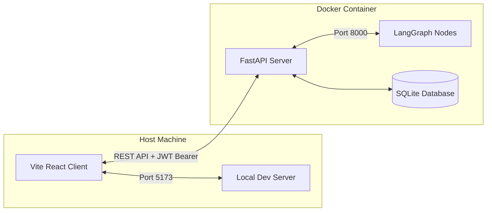

# Documentation: Streamlit to Vite + React + shadcn/ui Migration

This document serves as the official architecture guide and migration checklist for the transition from the monolithic **Streamlit** user interface to a state-of-the-art **Vite + React + TypeScript + Tailwind CSS (v4)** single-page application utilizing **shadcn/ui** design tokens and dynamic **i18n (Internationalization)**.

---

## 🏗️ Architectural Evolution

The original design bundled the application's presentation layers directly in Streamlit scripts. By introducing a modern React frontend, we decoupled the UI entirely from the backend, achieving high performance, deep layout control, and flawless responsiveness.

### Decoupled Architecture Diagram



---

## 📱 Mobile-First & Touch-First Ergonomics

Adhering strictly to `/mobile-design` parameters:
1. **The Thumb Zone Rule**:
   * **Desktop View**: Renders an immersive, transparent left Sidebar with glassmorphism effects, housing the brand title, dashboard navigation tabs, active human-agent status profiles, language toggle controls, and logout actions.
   * **Mobile View**: Converts the navigation into a compact top branding bar and a floatable **Bottom Navigation Bar** that places primary actions directly within comfortable reach of the user's thumb for fluid single-handed operations.
2. **Touch Targets**: All interactive elements, inputs, button icons, and menu anchors possess a minimum touch target size of $\ge 48px$ on mobile configurations.
3. **Instant Visual Feedback**: Active micro-animations (`active:scale-98`) and loading spinner overrides prevent duplicate form submissions or frozen states.

---

## 🎨 Feature Breakdown & Migration Details

All rich functionalities from the original Streamlit components were successfully migrated and visual-fidelity augmented:

### 1. Unified Dashboard (`Home.tsx`)
* **Dynamic KPI Statistics**: Calculates total tickets, resolved rates, pending review queues, and AI confidence parameters.
* **Critical Ticket Logs**: Renders a list of the most urgent incidents requiring immediate attention.
* **AI Agent Health Monitor**: Diagnoses latency metrics, database sync status (Qdrant), and percentage metrics of automated resolutions.

### 2. Tabbed Incident Tray (`Tickets.tsx`)
* Includes instant keyword search queries across Ticket IDs, user descriptors, and titles.
* Dynamic navigation tab switches for "All", "Pending", and "Resolved" categories.
* Adaptive tables that morph into beautiful card lists on mobile touchscreens.

### 3. State-Dependent Auditor View (`TicketDetail.tsx`)
The details pane dynamically checks the ticket's `status` to render the appropriate professional card view:
* **`Human Review`**: Renders the conversation log, knowledge base reference indicators, and the **Live Word-by-Word Diff Editor**.
* **`Resolved`**: Displays a success panel highlighting the resolution method (AI vs Human), resolved timestamps, and resolution timelines.
* **`AI Processing`**: Renders an animated progress bar indicating active LangGraph execution pipelines.
* **`Manual Handling`**: Displays warning layouts showing high-urgency SLA alerts (15 Mins remaining limit indicator).

---

## 📝 The Live Word-by-Word Diff Editor

In `pages/ticket_details.py`, Python's `difflib.ndiff` was used to display response alterations. In React, we custom-built a **natively optimized, word-by-word diff engine** inside `TicketDetail.tsx`. 

As the agent edits the generated AI response, the component runs a quick diff algorithm and renders:
* Word **Additions** in **bold green** with a light background badge.
* Word **Deletions** in **strike-through red** with a light background badge.
* Unchanged words as standard text.

---

## 🌐 Dynamic i18n Architecture

The internationalization is managed through a React Context provider (`src/utils/i18n.tsx`) supporting instant language toggles without full-page reloads.

* **Primary Language**: English (`en`).
* **Secondary Language**: Spanish (`es`).

### How to use i18n translation keys
Instead of hardcoding text, always use the `t` translator function:

```tsx
import { useTranslation } from '@/utils/i18n';

export function ExampleComponent() {
  const { t } = useTranslation();
  return (
    <div>
      <h3>{t('detail.title')}</h3>
      <p>{t('detail.confidence.label')}</p>
    </div>
  );
}
```

### Adding New Keys
To add a translation, simply append the key-value pair to both `en` and `es` dictionaries inside `src/utils/i18n.tsx`:

```typescript
const translations = {
  en: {
    'my.new.key': 'Hello World'
  },
  es: {
    'my.new.key': 'Hola Mundo'
  }
};
```

---

## 🚀 Deployment Instructions

### 1. Run the Backend API (via Docker)
Build and run the containerized FastAPI server to avoid package configuration overhead:
```bash
# From the root directory
docker compose up --build
```
*The server will run on `http://localhost:8000` with active hot-reload volumes.*

### 2. Run the React Client (Locally)
Serve the high-performance Vite server locally on your host:
```bash
# In another terminal window
cd frontend
npm run dev
```
*Open `http://localhost:5173` in your browser to experience the upgraded ticket resolution cockpit.*
